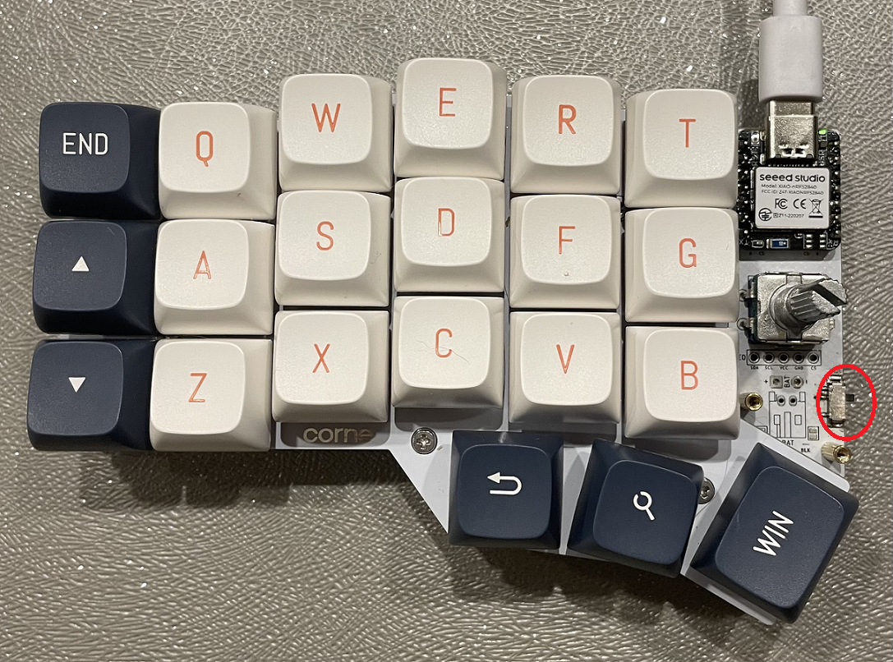
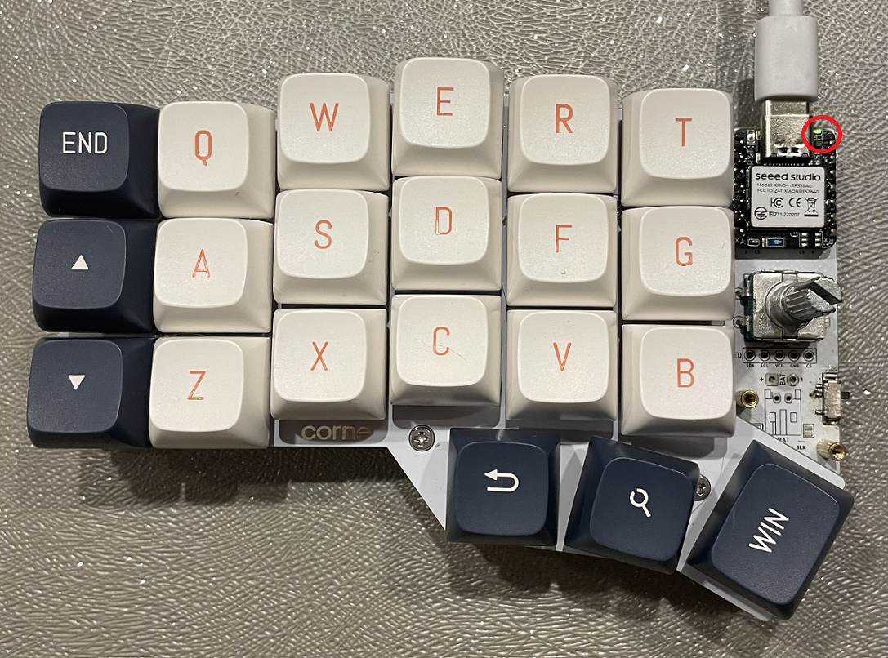
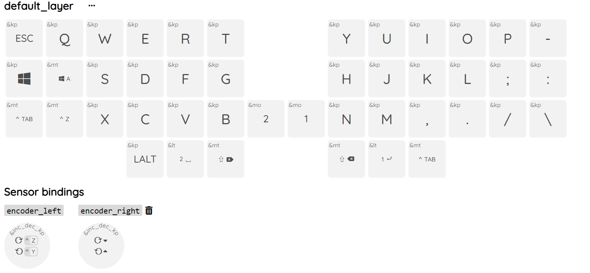
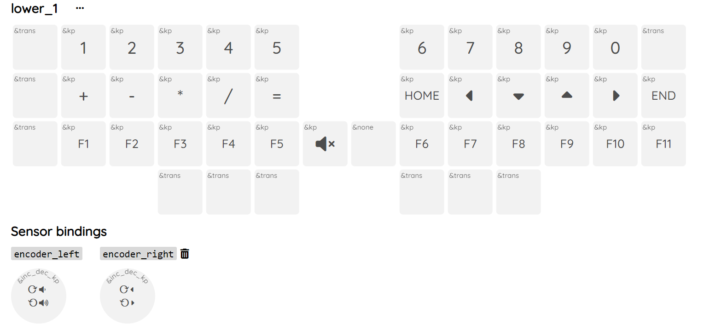
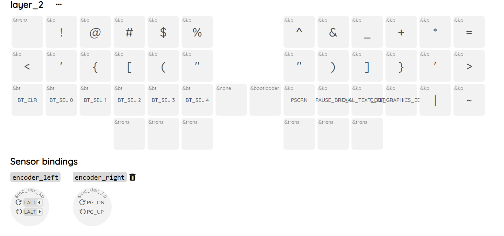
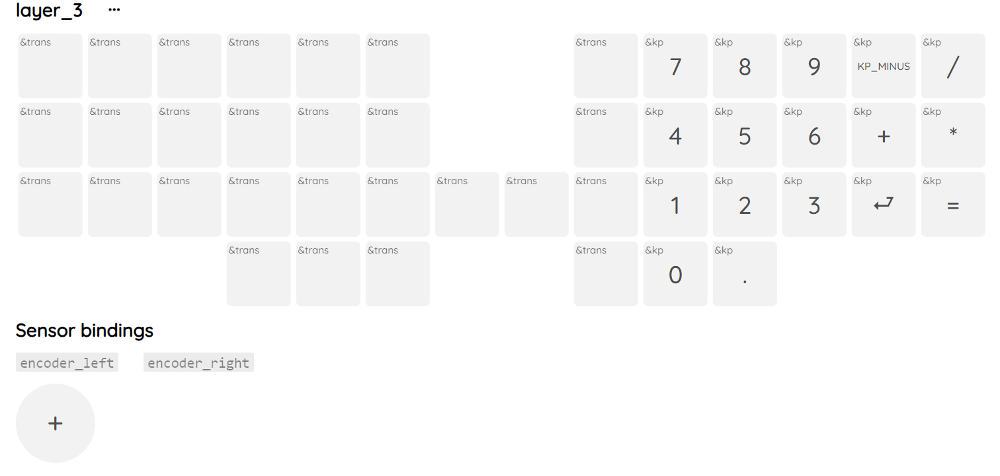
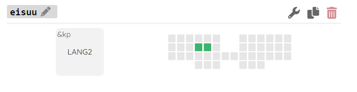
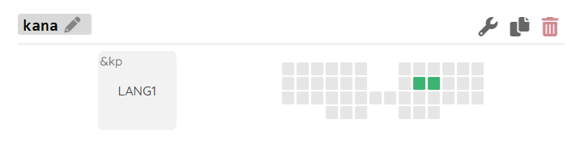
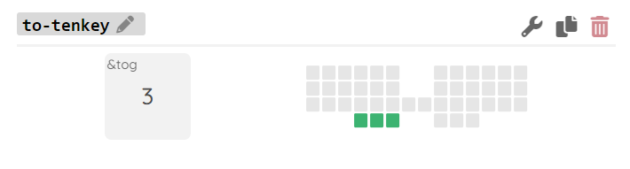

## bluetooth対応ロータリーエンコーダ付きcorne
- フォームウェアにZMKを使用
- 5個のbluetooth接続プロファイルを保持
- 有線接続にも対応。
- LiPoバッテリーを搭載し、繰り返し充電可能 
- ロータリーエンコーダ搭載

## 電源スイッチ
- 電源スイッチは下記写真の〇印の箇所にあります。上がON,下がOFFです。

## LED点灯
- 電源スイッチは下記写真の〇印の箇所にあります。
 

- 電源投入時に２度点滅します
- 1回目　バッテリー残量　グリーン：100～80％　　イエロー：80～20％　　レッド：20～0％
- 2回目　bluetooth接続状態　　ブルー：接続完了　　イエロー：未設定　　　レッド：未接続

## 特記事項
- 充電する際は、スイッチONの状態で行ってください。
- 左手キーボードはバッテリー充電中にbluetoothとデバイスとの接続が遮断されます。充電しながらキーボードを使用したい場合は、使用するデバイスと有線接続で利用して下さい。他のデバイスやコンセントで充電している間は使用不可となります。
- bluetooth接続プロファイルはキーボード上で選択、削除ができます。
- PCの設定はUS配列を推奨します。日本語配列にて使用すると、記号など設定したキーと異なる出力がされてしまうことがあります。
- デフォルトキーマップとしてフォームウエアをuf2フォルダに保管しています。
- フォームウエアの変更時にBluetoothの接続に不調があれば、一旦uf2フォルダに保管してある`settings_reset-seeeduino_xiao_ble-zmk.uf2`を書き込んでみてください。

## キーマップの変更方法
- githubにログインしてください。アカウントをお持ちでなければ作成してください。
- このリポジトリをフォークして、自身のリポジトリとしてください。
- 初回のみ、Actionsを開いて次のボタンをクリックしてください。
- [キーマップエディタ](https://nickcoutsos.github.io/keymap-editor/)でgithubと連携後、キーマップを変更し、saveボタンを押してください。
- 5分程度経過するとフォームウェアの生成が完了しますので、このボタンをクリックしてください。
- 画面下部へスクロールして `firmware.zip`をダウンロード及び解凍してください。
- キーボードをPCと接続し、写真の〇印にリセットボタンがあるので、ダブルクリックしてください。
- リセットボタンを押すことに慣れれば、爪楊枝やピンセット等を使用してカバーを外さずにダブルクリックができるようになります。しかし、最初はカバーを外して、そのカバーを使用してリセットボタンをクリックすることをお勧めします。
- ダブルクリックに成功すると、`XIAO-SENSE`という名前でドライブが認識されるので、作成したキーマップのフォームウェアを書き込んでいきます。
- 左のキーボードには`corny_left rgbled_adapter-seeeduino_xiao_ble-zmk`、右のキーボードには`corny_right rgbled_adapter-seeeduino_xiao_ble-zmk`を書き込んでください。

  ## デフォルトレイヤーの一覧
- ロータリーエンコーダの押し込みも１つのキーとして認識されます。例えば、初期レイヤ―では左手のロータリエンコーダは、取り消し,やり直しが登録されていますが、押し込みながら操作するとことでブラウザでの進む，戻るの操作が可能となっています。
- コンボという2キー以上の同時押しによるキー割り当てがあり、D,F同時押しで半角英数字入力J,K同時押しでひらがな入力としています。
- レイヤー2にbluetooth設定のキー配置をしています。BT_SEL0～4の切り替えで接続先デバイスの切替が可能で、BT_CLTにてプロファイル削除が可能です。

- 初期レイヤー

- レイヤー1
 
- レイヤー2

- レイヤー3

- 英数
  

- かな
  

- テンキー(レイヤー3)移行
  

